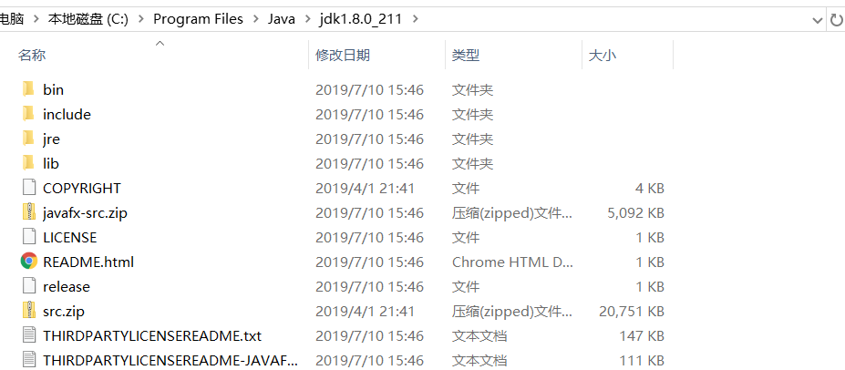

## Java2SE

### jdk

- JDK:Java Development Kitten (java开发工具包)
- JRE:Java Runtime Environment(Java运行时环境)
- JVM:Java Virtual Machine(java虚拟机),解释器的作用(跨平台)

- 开闭原则：对于扩展是开放的，对于修改是关闭。

  **jdk是给开发人员使用的，jre和jvm是给普通用户使用**

### jdk的安装

##### 按提示进行安装(默认即可)



  1、bin：该路径下存放了JDK的各种工具命令，常用的javac、java等命令就放在该路径下。
 
  2、db：该路径是安装Java DB的路径。
  
  3、include：一些平台特定的头文件。
  
  4、jre：该路径下安装的就是运行Java程序所必须的JRE环境。
  
  5、lib:该路径下存放的是JDK工具命令的实际执行程序。（即bin中绝大部分命令运行的是lib中程序）
  
  6、javafx-src.zip：该压缩文件里存放的就是Java FX所有核心类库的源代码，本书不会涉及Java FX的相关内容。
  
  7、src.zip：该压缩文件里存放的是Java所有核心类库的源代码。
  
  8、README和LICENSE等说明性文档。


##### 环境变量的配置
- CLASSPATH: .;%JAVA_HOME%\lib;%JAVA_HOME%\lib\tools.jar
- JAVA_HOME: C:\Program Files\Java\jdk1.8.0_211
- PATH:%JAVA_HOME%\jre\bin  %JAVA_HOME%\bin\

##### 测试安装结果
- 命令：java、javac、java -version
**Windows+R键进入cmd**
- 通过盘符d:、c:、 cd 、dir进入Java源文件相关目录
- javac HelloWorld.java 编译.java文件，生成.class的字节码文件
- java  HelloWorld      运行字节码文件

### 进制的转换
- Java通过编译.java生成.class文件
-  二进制：0 1
- 十进制：0 1 2 3 4 5 6 7 8 9
-  十进制转二进制：除二取余  小数取整 ，乘2取整
-  178
-  10110010
-  二进制转十进制：从右边开始乘以权重值，根据顺序，从0次方开始
-  八进制: 0 1 2 3 4 5 6 7
- 除八取余
-  十六进制：0 1 2 3 4 5 6 7 8 9 A B C D E F

### 入门程序
```java
package cn.study;
/**
 * 入门程序：HelloWorld
 * @author 汤实鑫
 *
 */
public class HelloWorld {
	/**
	 * Java程序入口
	 * @param args 运行main方法的时候传进来的数据
	 */
	public static void main(String[] args) {
		System.out.println("hello world!");
	}
}
```